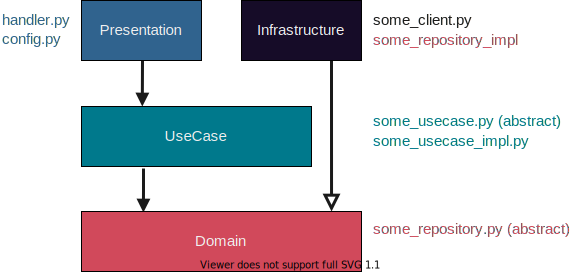

# Structure

NOTE: The directories named `presentation`, `usecase`, `domain`, `infrastructure` are one of example of layer pattern (simplified onion architecture). You don't have to follow this pattern.

Entrypoint is `presentation/handler/handle_request`